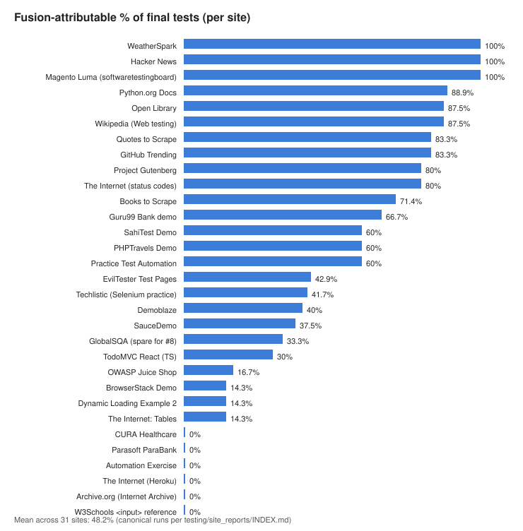
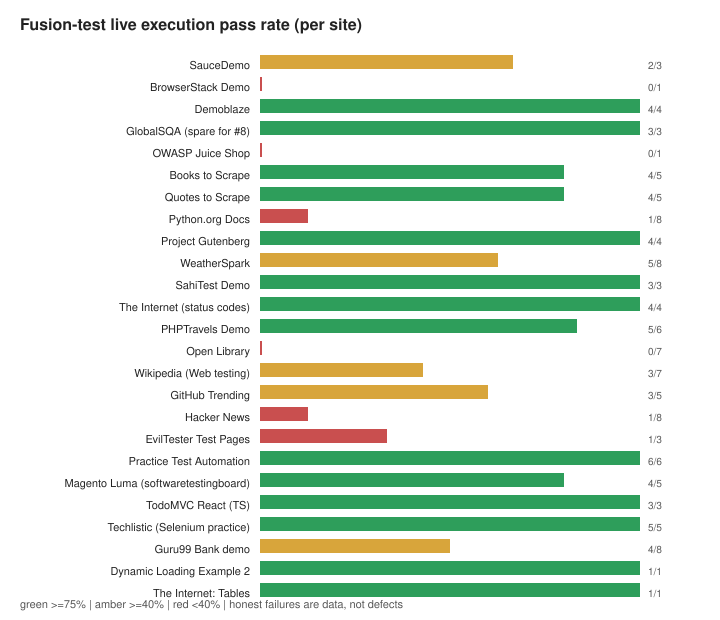
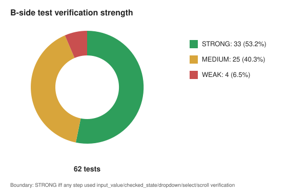
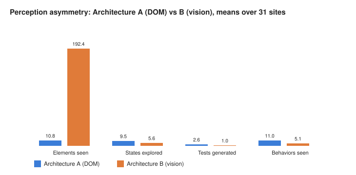

# Vision Test MCP + Dual-Perception Web Testing System

[](LICENSE)


**Autonomous web UI testing as MCP tools for AI agents.** Two independent
explorers test any website — one reads the DOM, one *looks at screenshots*
(YOLO ScreenParser + OCR) — and a deterministic fusion layer merges their
findings into grounded, live-executed test cases. No selectors invented,
no coordinates trusted blindly, no failures hidden.

- **MCP server (beta):** [`vision-test-mcp`](https://github.com/sandeep11mahendrakar/mcp-for-the-testing-temp-/releases/tag/v1.0.0-mcp) — 5 tools, stdio JSON-RPC, verified end-to-end
- **Validated on:** 40-site evaluation campaign (demo apps → real e-commerce, banking, docs, news, production platforms)
- **Audited:** independent adversarial audit; every headline number recomputes from raw artifacts

---

## Why pick this MCP over selector-based testing tools

| Capability | Selector-based tools | **This system** |
|---|---|---|
| Works on canvas/visual-only UIs | ❌ | ✅ screenshot-driven |
| Detects silently broken values | partial | ⚠️ documented ceiling ([mutation study](mutation/results/ANALYSIS.md)) |
| Failure honesty | varies | **every FAIL classified**, zero silent passes |
| Grounding | selector trust | live re-detection + pre-click verification |
| Evidence trail | logs | per-step screenshots + typed JSON verdicts |

## Architecture

```
 Arch A (DOM)                Arch B (Vision)              Fusion
┌──────────────────┐   ┌──────────────────────────┐   ┌─────────────────────┐
│ Playwright DOM    │   │ Screenshot → YOLO11       │   │ S1 canonical catalog│
│ extraction        │   │ ScreenParser (55 classes) │   │ (deterministic      │
│ → LLM action loop │   │ + Tesseract OCR           │   │ merge of A+B)       │
│ → memory log      │   │ → visual DOM JSON         │   │ S2 coverage gaps    │
│ → grounded tests  │   │ → LLM agent loop          │   │ S4 grounded LLM     │
│                   │   │ → coordinate replay w/    │   │ synthesis (1 call,  │
│                   │   │   live re-detection       │   │ validator-gated)    │
└─────────┬─────────┘   └──────────┬────────────────┘   │ FT live execution   │
          └────────────────────────┼────────────────────┘ │ S6 dashboard        │
                                   ▼                      ▼                     │
                          ┌─────────────────────────────────────────┘
                          ▼
            runs/<run_id>/  (catalog · gaps · fusion tests · FT results · dashboard)
```

**MCP server** (`new mcp testing ground/mcp/server.js` in the dev clone;
[`vision-test-mcp` release](https://github.com/sandeep11mahendrakar/mcp-for-the-testing-temp-/releases/tag/v1.0.0-mcp))
exposes 5 tools over stdio JSON-RPC: `explore_site`, `list_tests`,
`run_test`, `get_evidence`, `get_visual_dom`.

## Verified MCP capabilities

| Check | Result |
|---|---|
| initialize + tools/list roundtrip | PASS |
| explore_site live roundtrip (example.com + real site) | PASS |
| run_test live replay (4/4 steps in 10.3s over stdio) | PASS |
| get_evidence (results + screenshot paths) | PASS |
| typed errors (-32601/-32602/-32002/-32006) | PASS |

Known limits (honest): single-instance under parallel agents (fixed vision-service
ports), first-capture flake ~1-in-3 (retry succeeds upstream of MCP), upstream
LLM provider rate limits apply.

## Results — 40-site evaluation campaign

Final scoreboard (every row verdict-registered; full table in
[testing/site_reports/INDEX.md](testing/site_reports/INDEX.md)):

```text
Sites attempted:             40
Cleared (guard-passing):     29
BLOCKED-honest:               7   (bot-walls recorded without quota burn)
DO-NOT-CITE (evidence only):  4   (contamination incident, remediated + audited)
Fusion tests accepted:       98
Fusion live executed:        98   PASS 56 / FAIL 42 (all classified)
Mean fusion-attributable:    48.7% (n=19 dashboards)
```

### Fusion-attributable coverage by site



### Live fusion-test pass rates



### Vision test-quality rubric



### Perception asymmetry — what each architecture sees alone



**Key findings:** fusion value grows with site realism (~20% on friendly demo
apps → 48.7% campaign mean, up to 100% on real sites); B sees ~16–22× more
elements than A while A generates more executable tests; the system verifies
that *actions work*, not that *values are correct* — proven by seeded-bug
mutation study, making assertion-oracle synthesis the top future item.

Full data: [TIER2_MEGA_REPORT](testing/TIER2_MEGA_REPORT.md) ·
[TIER3_MEGA_REPORT](testing/TIER3_MEGA_REPORT.md) ·
[D11_FINAL_BATCH_MEGA_REPORT](testing/D11_FINAL_BATCH_MEGA_REPORT.md) ·
[CAMPAIGN_EVALUATION](testing/CAMPAIGN_EVALUATION.md) ·
[VISION_TEST_QUALITY](testing/VISION_TEST_QUALITY.md)

## Quickstart (Claude Code / opencode)

Prerequisites: Node.js 18+, Python 3.10+ (`pip install -r
services/yolo-service/requirements.txt -r services/ocr-service/requirements.txt`),
Tesseract OCR, and LLM API keys in `.env` (never committed — see `.env.example`).

```json
{
  "mcpServers": {
    "vision-test-mcp": {
      "command": "node",
      "args": ["path/to/mcp/server.js"],
      "env": { "ARCH_B_LLM_API_KEY": "<your-key>" }
    }
  }
}
```

Then ask your agent: *"explore https://example.com and generate tests"*.

## Repository map

```
web/       Architecture A — DOM + state-machine explorer (Node)
vision/    Architecture B — Vision explorer (Node + YOLO Python services)
fusion/    Deterministic merge + grounded synthesis + live executor + dashboard
lib/       Shared LLM transport + fuzzy matching
testing/   40-site campaign ledger, reports, audit trail, quality rubric
mutation/  Seeded-bug detection harness (verification-ceiling evidence)
docs/      Audit report, readiness analysis, research paper draft, graphs
runs/      Per-site artifacts (gitignored; regenerate via commands in reports)
```

## License & Credits

[MIT](LICENSE) © 2026 sandeep11mahendrakar.

_Acknowledgement: initial architecture concept (v0) developed in collaboration
with Team 101, PES University; all implementation, evaluation, and documentation
by the repository author._
